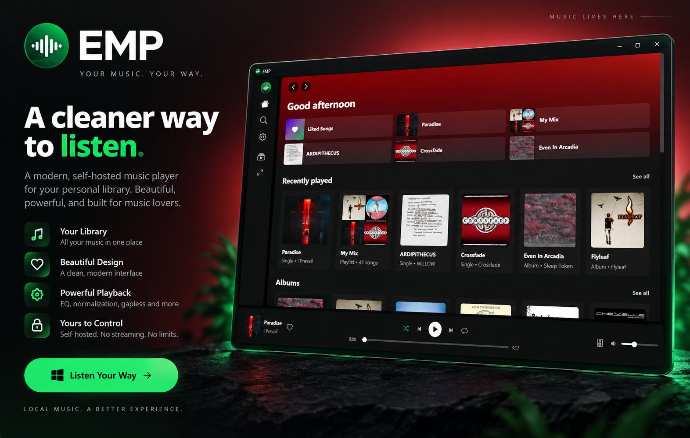

<p align="center">
  
</p>

<p align="center">
  
</p>

# EMP

[](https://www.microsoft.com/windows)
[](https://dotnet.microsoft.com/download)
[](https://github.com/lazytitanz/EMP)
[](https://github.com/lazytitanz/EMP/commits/main)

## Download

Download the latest Windows release from the [Releases page](https://github.com/lazytitanz/EMP/releases/latest).

Extract the downloaded archive, then run **EMP.exe**. EMP does not require installation.

EMP is a modern music player for Windows built around the music you already own.

It combines a familiar, streaming-style interface with local playback, library management, playlists, audio controls, and network playback — without requiring a streaming service or account.

## Features

### Your music library

Add one or more music folders and EMP will organize your collection into albums, artists, singles, tracks, and playlists. Changes to your music folders are detected automatically, so your library stays up to date.

- Albums, artists, singles, tracks, playlists, and Liked Songs
- Library search with grid and list views
- Recently played music and quick picks
- Create, edit, and delete playlists
- Automatic library updates when files change
- Optional artist information from MusicBrainz
- Artwork-driven colors throughout the interface

### Playback

EMP includes the controls you'd expect from a full desktop music player while keeping playback local to your PC.

- Shuffle and repeat
- Seek and volume controls
- Crossfade and gapless playback
- Volume normalization
- Equalizer with presets
- Windows system media controls
- Taskbar playback controls
- Session restore for your queue, track, and playback position

Supported audio formats include **MP3, M4A, AAC, FLAC, WAV, OGG, Opus, WMA, AIFF, and ALAC**.

### Connect to a device

EMP can also play your music through compatible devices on your local network.

- **Google Cast** — Chromecast and Cast-enabled speakers and displays
- **DLNA / UPnP** — compatible TVs, speakers, and media renderers

Open **Connect to a device** from the player bar and choose where you want to listen.

When casting, the original audio file is served directly from your PC over your local network. EMP does not upload your music to a cloud service or transcode it.

> Audio processing such as the equalizer, crossfade, and gapless playback applies to playback on this computer and is not applied when sending the original file to another device.

## Why EMP?

EMP is for people who keep their own music collection but still want the experience of a modern desktop music app.

There is no streaming catalog to subscribe to and no account required to listen. Choose your music folders and EMP builds the experience around your collection.

The goal is simple: **make a local music library feel as polished and convenient as a modern streaming app.**

## Requirements

- Windows 10 version 2004 or later
- [.NET 10](https://dotnet.microsoft.com/download)
- [Microsoft Edge WebView2 Runtime](https://developer.microsoft.com/microsoft-edge/webview2/)

## Build and run

Clone the repository, then run:

```bash
dotnet restore
dotnet run